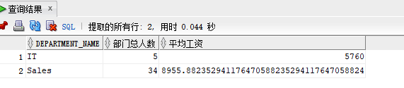
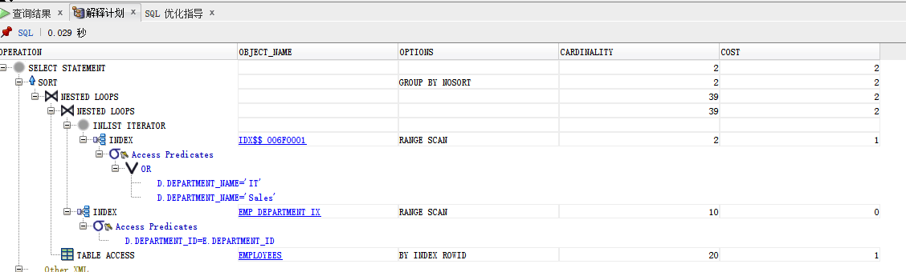
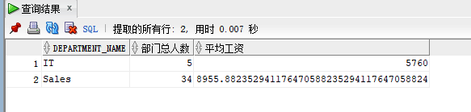
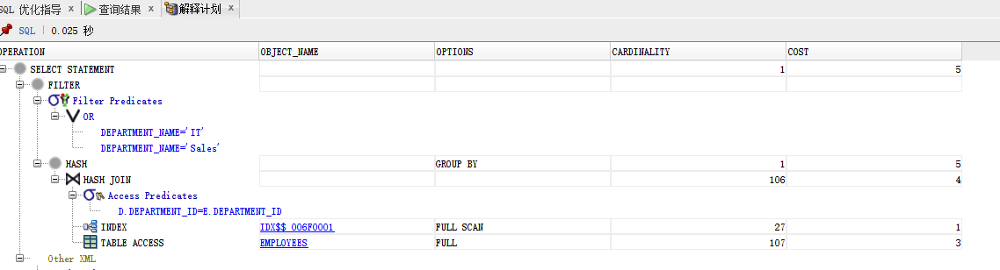
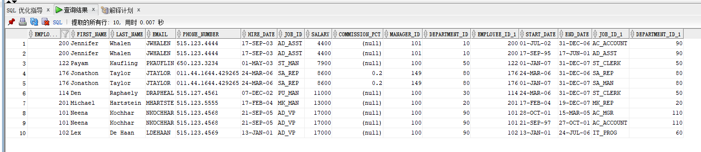
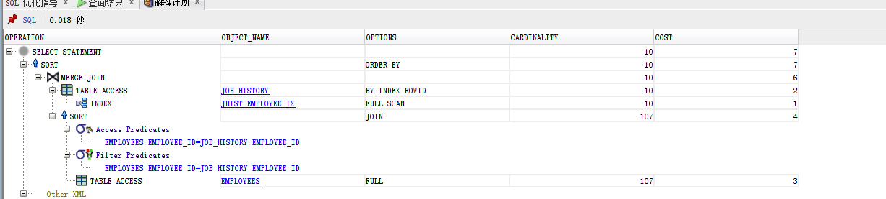

<<<<<<< HEAD
# 实验一 ：分析SQL执行计划，执行SQL语句的优化指导
## 教材中的语句查询
=======
# 实验一 ：分析SQL执行计划，执行SQL语句的优化指导<br>
## 教材中的语句查询<br>
>>>>>>> c1c77f6cca87d2c37a1d8150b83b4f17cd2805b3
### 查询1：<br>
   ```sql
    SELECT d.department_name,count(e.job_id)as "部门总人数",
    avg(e.salary)as "平均工资"
    from hr.departments d,hr.employees e
    where d.department_id = e.department_id
    and d.department_name in ('IT','Sales')
    GROUP BY department_name;
   ```
<<<<<<< HEAD
   查询结果：
 解释计划：
=======
 查询结果：
>>>>>>> c1c77f6cca87d2c37a1d8150b83b4f17cd2805b3
### 查询2：<br>
   ```sql
   SELECT d.department_name,count(e.job_id)as "部门总人数"，
   avg(e.salary)as "平均工资"
   FROM hr.departments d,hr.employees e
   WHERE d.department_id = e.department_id
   GROUP BY department_name
   HAVING d.department_name in ('IT','Sales');
   ```
查询结果:
解释计划:
分析：总的来看，查询1比查询2更优，查询1时先过滤后汇总，而查询2时先汇总后过滤，查询1参与汇总和计算的数据量少，查询2参与的数据量多。<br>
## 自定义查询
   ```sql
   select * from employees,job_history
   where employees.employee_id=job_history.employee_id
   order by 8;
   ```
  查询结果：
  解释计划：
  
<<<<<<< HEAD
   分析：查找employees表与job_history表中employee_id相同的数据，并按照salary由大到小排序。
   从一张表中抽出一个数据与另一张表查找相应记录，如此反复直至完成。
=======
   分析：查找employees表与job_history表中employee_id相同的数据，并按照salary由大到小排序。从一张表中抽出一个数据与另一张表查找相应记录，如此反复直至完成。
>>>>>>> c1c77f6cca87d2c37a1d8150b83b4f17cd2805b3
