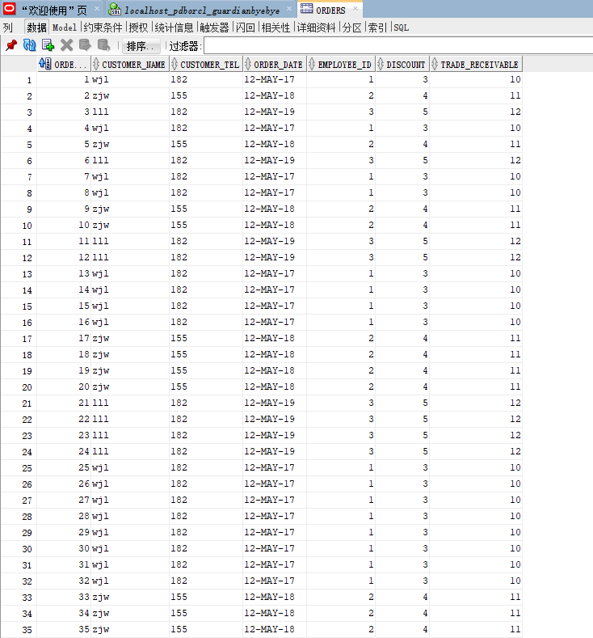
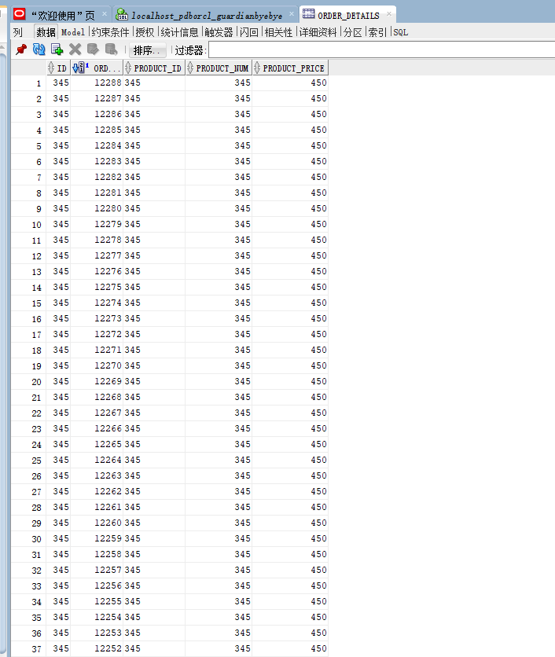
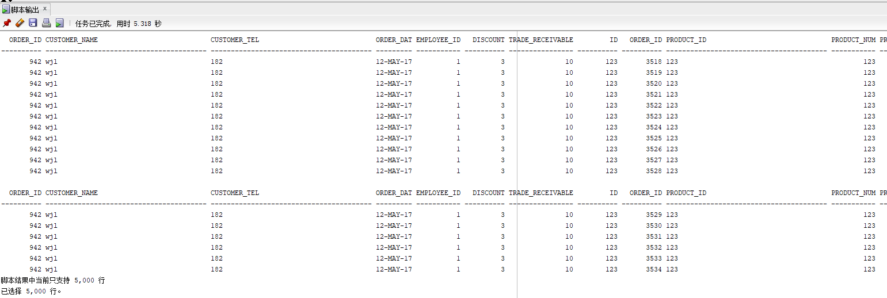
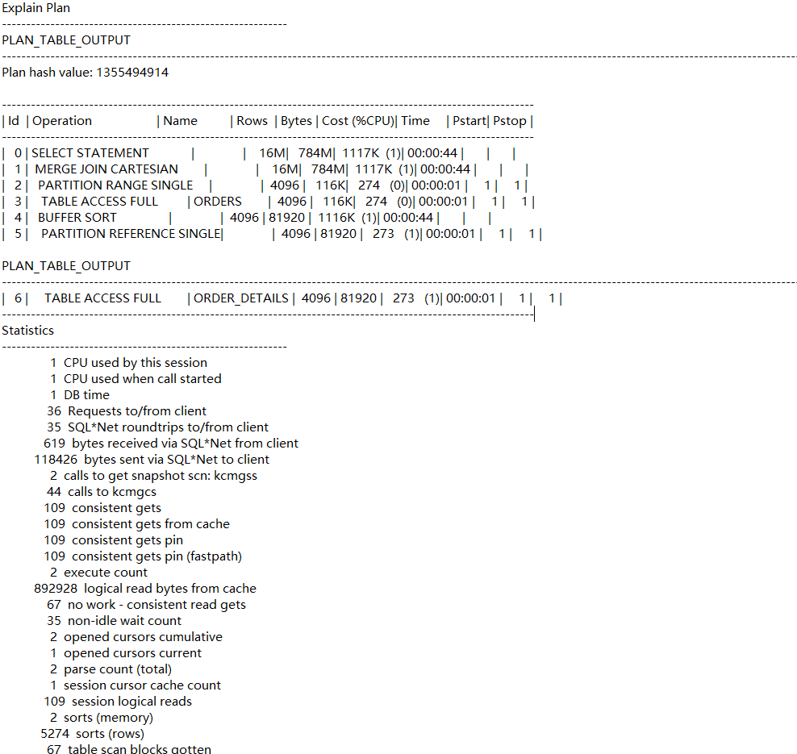
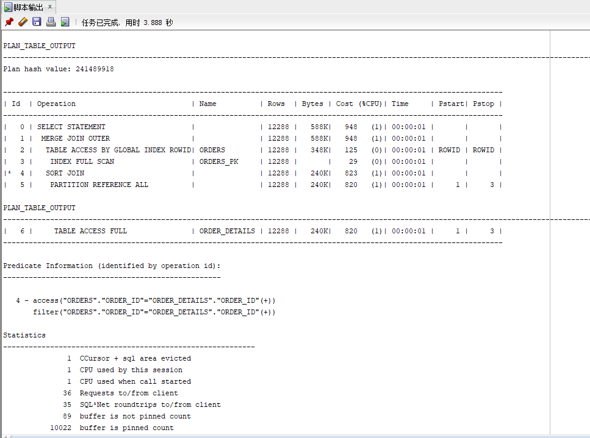
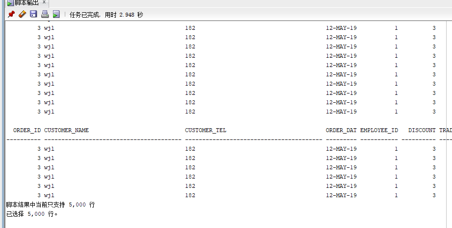
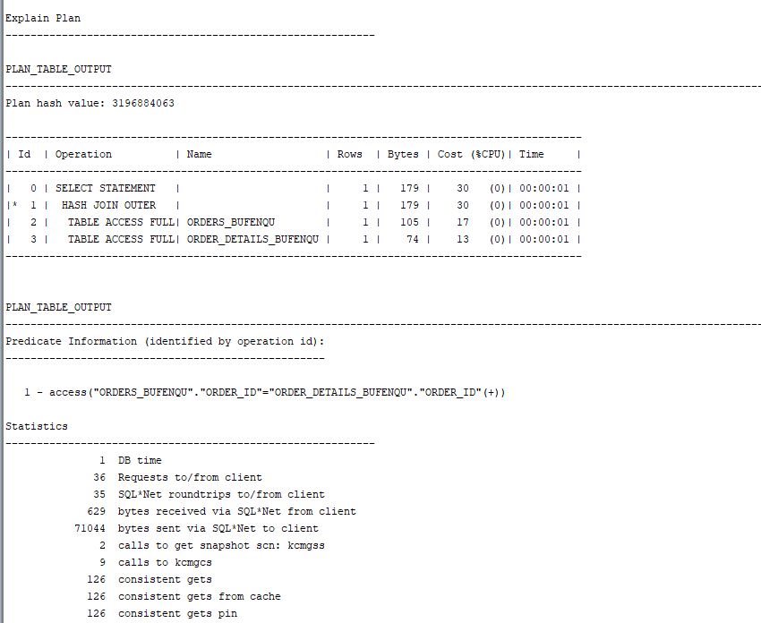

# 实验3：创建分区表
## 实验目的：掌握分区表的创建方法，掌握各种分区方式的使用场景。
## 实验内容：
* 本实验使用3个表空间：USERS,USERS02,USERS03。在表空间中创建两张表：订单表(orders)与订单详表(order_details)。
* 使用你自己的账号创建本实验的表，表创建在上述3个分区，自定义分区策略。
* 你需要使用system用户给你自己的账号分配上述分区的使用权限。你需要使用system用户给你的用户分配可以查询执行计划的权限。
* 表创建成功后，插入数据，数据能并平均分布到各个分区。每个表的数据都应该大于1万行，对表进行联合查询。
* 写出插入数据的语句和查询数据的语句，并分析语句的执行计划。
* 进行分区与不分区的对比实验。
## 实验步骤：
* 创建主表order：
    ```sql
    CREATE TABLE ORDERS
    (
    order_id NUMBER(10,0)NOT NULL,
    customer_name VARCHAR2(40 BYTE)NOT NULL,
    customer_tel VARCHAR2(40 BYTE)NOT NULL,
    order_date DATE NOT NULL,
    employee_id NUMBER(6,0) NOT NULL,
    discount NUMBER(8,2)DEFAULT 0,
    trade_receivable NUMBER(8,2)DEFAULT 0
    )
    TABLESPACE USERS
    PCTFREE 10
    INITRANS 1
    STORAGE
    (
    BUFFER_POOL DEFAULT
    )
    PARTITION BY RANGE (order_date)
    (
    PARTITION partition_before_2018 VALUES LESS THAN (
    TO_DATE(' 2018-01-01 00: 00: 00', 'SYYYY-MM-DD HH24: MI: SS',
    'NLS_CALENDAR=GREGORIAN'))TABLESPACE USERS,
    
    PARTITION partition_before_2019 VALUES LESS THAN (
    TO_DATE(' 2019-01-01 00: 00: 00', 'SYYYY-MM-DD HH24: MI: SS',
    'NLS_CALENDAR=GREGORIAN'))TABLESPACE USERS02,
    
    PARTITION partition_before_2020 VALUES LESS THAN (
    TO_DATE(' 2020-01-01 00: 00: 00', 'SYYYY-MM-DD HH24: MI: SS',
    'NLS_CALENDAR=GREGORIAN'))TABLESPACE USERS03
    );
  ```
 * 创建从表 order_details：
  ```sql
  CREATE TABLE order_details
  (
  id NUMBER(10,0)NOT NULL,
  order_id NUMBER(10,0)NOT NULL,
  product_id VARCHAR2(40 BYTE)NOT NULL,
  product_num NUMBER(8,2) NOT NULL,
  product_price NUMBER(8,2) NOT NULL,
  CONSTRAINT order_details_fk1 FOREIGN KEY (order_id)
  REFERENCES orders ( order_id )
  ENABLE
  )
  TABLESPACE USERS
  PCTFREE 10 
  INITRANS 1
  STORAGE( BUFFER_POOL DEFAULT )
  NOCOMPRESS NOPARALLEL
  PARTITION BY REFERENCE (order_details_fk1);
```
* 向ORDERS表中插入数据：
    ```sql
    //先分别向三个分区插入一条数据
    INSERT INTO orders(customer_name, customer_tel, order_date, employee_id, trade_receivable, discount) VALUES('wjl', '182', to_date ( '2017-05-12 13:25:20' , 'YYYY-MM-DD HH24:MI:SS' ), 1, 10, 3);
    INSERT INTO orders(customer_name, customer_tel, order_date, employee_id, trade_receivable, discount) VALUES('zjw', '155', to_date ( '2018-05-12 13:25:20' , 'YYYY-MM-DD HH24:MI:SS' ), 2, 11, 4);
    INSERT INTO orders(customer_name, customer_tel, order_date, employee_id, trade_receivable, discount) VALUES('lll', '182', to_date ( '2019-05-12 13:25:20' , 'YYYY-MM-DD HH24:MI:SS' ), 3, 12, 5);
    //再查询表中存在的数据并插入表中
    insert into orders
    select *
    from orders;
  
    ```
    ORDERS表中部分数据：
     
 * 像ORDER_DETAILS表中插入数据：
    ```sql
    insert into order_details(id, PRODUCT_ID, PRODUCT_NUM, PRODUCT_PRICE) VALUES(123, 123, 123, 250);
    insert into order_details(id, PRODUCT_ID, PRODUCT_NUM, PRODUCT_PRICE) VALUES(234, 234, 234, 350);
    insert into order_details(id, PRODUCT_ID, PRODUCT_NUM, PRODUCT_PRICE) VALUES(345, 345, 345, 450);
    insert into order_details
    select *
    from order_details;
    ```
    ORDER_DETAILS表中部分数据：
      
  * 联合查询：
  ```sql
    set autotrace on;
    SELECT *
    FROM orders partition (PARTITION_BEFORE_2020), order_details partition (PARTITION_BEFORE_2020);
  ```
  查询结果：
   
  执行计划：
  
  
  
  * 不分区查询：
     ```sql
    select * 
    from orders_bufenqu, order_details_bufenqu 
    where orders_bufenqu.order_id = order_details_bufenqu.order_id(+);
    ```
   查询结果：
   
   执行计划：
   
  
  分析：分区查询会在数据存在的区进行检索，耗时短，但是耗CPU高。不分区查询所需资源低，耗CPU低，但是查询所需时间长。