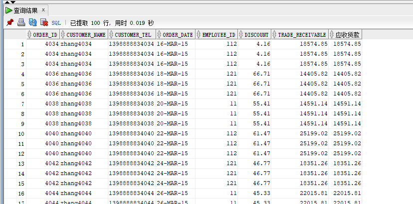

# 实验4：对象管理
##  实验目的：
了解Oracle表和视图的概念，学习使用SQL语句Create Table创建表，学习Select语句插入，修改，删除以及查询数据，学习使用SQL语句创建视图，学习部分存储过程和触发器的使用。
## 实验内容：
### 1.查询某个员工的信息
```sql
select * from EMPLOYEES where EMPLOYEE_ID=111;
```

### 2.递归查询某个员工及其所有下属，子下属员工。
```sql
WITH A (EMPLOYEE_ID,NAME,EMAIL,PHONE_NUMBER,HIRE_DATE,SALARY,MANAGER_ID,DEPARTMENT_ID) AS
  (SELECT EMPLOYEE_ID,NAME,EMAIL,PHONE_NUMBER,HIRE_DATE,SALARY,MANAGER_ID,DEPARTMENT_ID
    FROM employees WHERE employee_ID = 11
    UNION ALL
  SELECT B.EMPLOYEE_ID,B.NAME,B.EMAIL,B.PHONE_NUMBER,B.HIRE_DATE,B.SALARY,B.MANAGER_ID,B.DEPARTMENT_ID
    FROM A, employees B WHERE A.EMPLOYEE_ID = B.MANAGER_ID)
SELECT * FROM A;
```

### 3.查询订单表，并且包括订单的订单应收货款: Trade_Receivable= sum(订单详单表.ProductNum*订单详单表.ProductPrice)- Discount。
```sql
select a.*,(select sum(b.product_num*b.product_price)
from order_details b
where b.order_id=c.order_id
group by b.order_id)-a.discount Trade_Receivable
from orders a,order_details c
where a.order_id=c.order_id;
```

### 4.查询订单详表，要求显示订单的客户名称和客户电话，产品类型用汉字描述。
```sql
select customer_name,customer_tel,product_type as "产品名称"
from orders,order_details,products 
where orders.order_id=order_details.order_id and order_details.product_name=products.product_name;
```

### 5.查询出所有空订单，即没有订单详单的订单。
```sql
select a.*
from orders a left join order_details b
on a.order_id=b.order_id
where b.order_id is null
```

### 6.查询部门表，同时显示部门的负责人姓名。
```sql
select departments.*,employees.name as "负责人"
from departments,employees
where departments.department_id=employees.department_id
```
