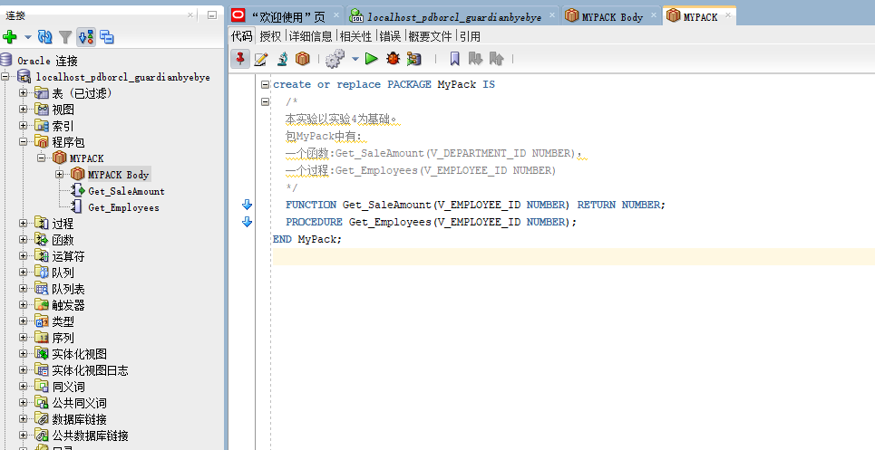
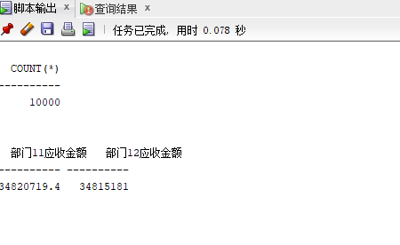
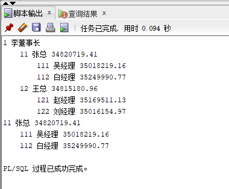

# 实验5：PL/SQL编程
## 实验目的：
* 了解PL/SQL语言结构
* 了解PL/SQL变量和常量的声明和使用方法
* 学习条件语句的使用方法
* 学习分支语句的使用方法
* 学习循环语句的使用方法
* 学习常用的PL/SQL函数
* 学习包，过程，函数的用法。
## 实验步骤：
* 创建包及函数
```sql
create or replace PACKAGE MyPack IS
  /*
  本实验以实验4为基础。
  包MyPack中有：
  一个函数:Get_SaleAmount(V_DEPARTMENT_ID NUMBER)，
  一个过程:Get_Employees(V_EMPLOYEE_ID NUMBER)
  */
  FUNCTION Get_SaleAmount(V_EMPLOYEE_ID NUMBER) RETURN NUMBER;
  PROCEDURE Get_Employees(V_EMPLOYEE_ID NUMBER);
END MyPack;
create or replace PACKAGE BODY MyPack IS
  FUNCTION Get_SaleAmount(V_EMPLOYEE_ID NUMBER) RETURN NUMBER
  AS
    N NUMBER(20,2); --注意，订单ORDERS.TRADE_RECEIVABLE的类型是NUMBER(8,2),汇总之后，数据要大得多。
    BEGIN
      SELECT SUM(O.TRADE_RECEIVABLE) into N  FROM ORDERS O,EMPLOYEES E
      WHERE O.EMPLOYEE_ID=E.EMPLOYEE_ID AND E.EMPLOYEE_ID =V_EMPLOYEE_ID;
      RETURN N;
    END;

  PROCEDURE GET_EMPLOYEES(V_EMPLOYEE_ID NUMBER)
  AS
    LEFTSPACE VARCHAR(2000);
    N NUMBER;

    begin
      --通过LEVEL判断递归的级别
      LEFTSPACE:=' ';
      --使用游标
      for v in
      (SELECT LEVEL,EMPLOYEE_ID,NAME,MANAGER_ID FROM employees
      START WITH EMPLOYEE_ID = V_EMPLOYEE_ID
      CONNECT BY PRIOR EMPLOYEE_ID = MANAGER_ID)
      LOOP
        N:=MYPACK.Get_SaleAmount(V.EMPLOYEE_ID);
        DBMS_OUTPUT.PUT_LINE(LPAD(LEFTSPACE,(V.LEVEL-1)*4,' ')||
                             V.EMPLOYEE_ID||' '||v.NAME||' '||N);
      END LOOP;
    END;

END MyPack;

```
* 创建之后的截图：

* 测试1
```sql
函数Get_SaleAmount()测试方法：
select count(*) from orders;
select MyPack.Get_SaleAmount(11) AS 部门11应收金额,MyPack.Get_SaleAmount(12) AS 部门12应收金额 from dual;
```
结果：
 
 
* 测试2
```sql
过程Get_Employees()测试代码：
set serveroutput on
DECLARE
  V_EMPLOYEE_ID NUMBER;    
BEGIN
  V_EMPLOYEE_ID := 1;
  MYPACK.Get_Employees (  V_EMPLOYEE_ID => V_EMPLOYEE_ID) ;  
  V_EMPLOYEE_ID := 11;
  MYPACK.Get_Employees (  V_EMPLOYEE_ID => V_EMPLOYEE_ID) ;    
END;
```
结果：

